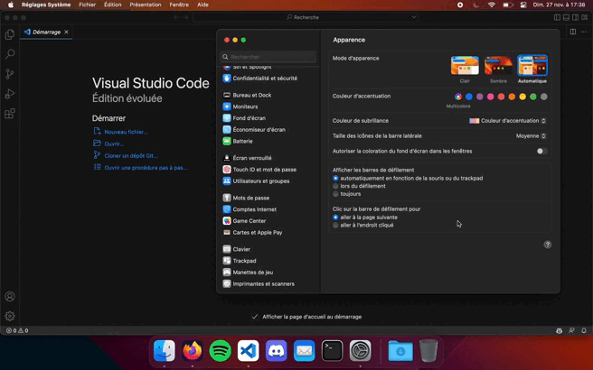
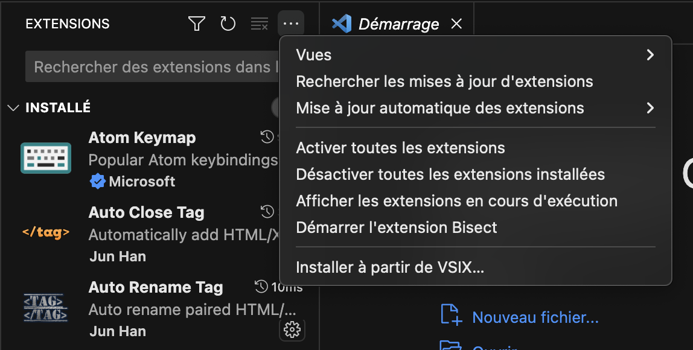

# OS Theme Switcher

A simple extension to follow your OS color scheme and switch VSCode theme accordingly.



For now, only macOS is supported, but I'm planning to add support for other OSes in the future.

## How it works

On VSCode startup, the extension will launch the daemon that will listen for OS theme changes. When a change is detected, the daemon will write to a file named `current-theme` the current theme. The extension will then read this file and switch the theme accordingly.

I've choosed to use this method instead of IPC because it allows to use the extension to be fully event driven on macOS. Chokidar uses the FSEvent API and my daemon the `NSDistributedNotificationCenter` API.

If the extensions in VSCode were less sandboxed *(Which I think, isn't a good thing 😅)* we could have skipped the daemon and used native Electron methods to switch the theme.
https://www.electronjs.org/fr/docs/latest/tutorial/dark-mode

Feel free to open an issue or a pull request, if you have any idea to improve this extension.

## Installation
For the extension to work, you need to compile the daemon first and place it wherever you want. The binary will be in the `out/` folder.
```bash
npm run daemon:osx
```
Then you can compile and package the extension with :
```bash
npm run package
```

After that, go into your VSCode settings and set theses :
```jsonc
// The path to the daemon folder
"os-theme-switcher.daemonFolderPath": "~/.ots/"

// The theme you want to be set when the OS is in dark mode
"os-theme-switcher.lightTheme": "Clair +"

// The theme you want to be set when the OS is in dark mode
"os-theme-switcher.darkTheme": "Sombre +"
```

You can now install the extension from the .vsix file generated at the root of this project by going into the extensions tab and clicking on the `...` button and then `Install from VSIX...`

Now restart VSCode and it should work.

And voilà, you're done !



## Credits

- [Bouke van der Bijl](https://github.com/bouk) for his [dark-mode-notify](https://github.com/bouk/dark-mode-notify) repo that helped me build my daemon.
